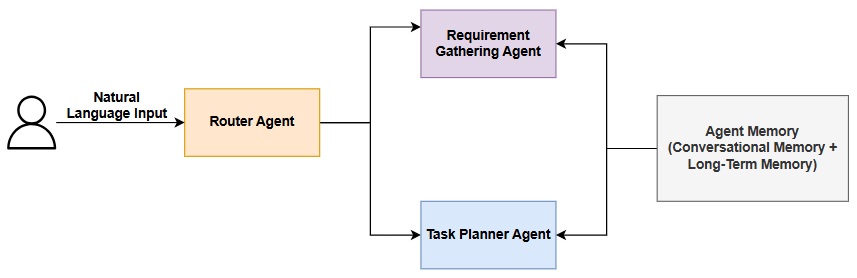
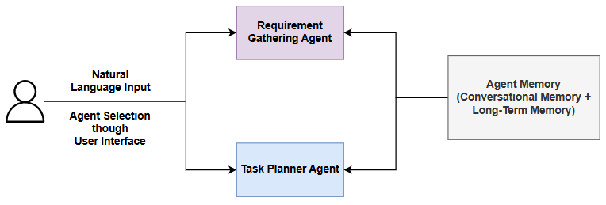

# Multi-Agent AI System

:::info[Task]

**Design AI System which will be able intake requirements for features and then split tasks for the corresponding features.**

:::

## Considerations

1. Similar to how we do `Design` (HLD or LLD), for any software feature, it is always good to design the AI workflow along with the whole system.
2. The way in which we provide UI/UX to the users also has an effect in which we design the AI system.
3. If the entire flow has a many AI Agents plugged together to accomplish a task, `Human In Loop (HIL)` checkpoints at necessary places will make the system with better performance.
4. `S` in `SOLID Principles` talks about Single Responsibility, it is always good to have an AI Agent which is good at preforming one task.
5. Other Considerations
   1. How much autonomy is needed?
   2. Accuracy Vs Latency
   3. Fallback scenarios
   4. Memory Scope (Short-Term or Long-Term)

From the above consideration, we may still have multiple ways in which we design the entire AI System for the above task. Let's consider a couple of approaches and implement the system.

## Approach 1

- User need not select if the input is a feature requirement of planning of tasks. Agent can identify based on input and do either requirement gathering or planning tasks.

A simple solution is provided below,



### Router Agent

- Here `router-agent` is the user facing agent which routes/hand-offs the task to other agents.
- The main job of this agent is to understand the user provided input and then determine which agent it has to route to.
- Below is a sample prompt for the router agent.

```python title="Router Agent Prompt"
router_agent_prompt = """
You are an AI Agent, where you will be routing the user query to the appropriate agent. You have access to the following agents:

1. Requirement Gathering Agent: This agent is responsible for gathering requirements from the user. It will ask questions to understand the user's needs and gather all necessary information.
2. Task Planner Agent: This agent is responsible for creating a task plan based on the requirements gathered by the Requirement Gathering Agent. It will break down the requirements into actionable tasks and create a plan to achieve the desired outcome.

## Inputs Provided:
1. User Query: {user_query}. This is the input provided by the user.
2. Conversational History: {conversation_history}. The whole conversation history between the user and the agents. This includes all previous interactions and responses.
    - You will only be provided with the latest 5 interactions in the conversation history to ensure you have enough context without overwhelming you with too much information.

## Output:
1. Select the appropriate agent (Requirement Gathering Agent or Task Planner Agent) to handle the user query based on the information provided in the user query and the conversational history.
2. A small explanation of why you chose that agent.
3. If the user query does not fit into the scope of the agent, say to the user that you are unable to assist with their query and provide a brief explanation.
"""
```

- Since, the router agent needs to hand-off the input to the proper agent, the result of the agent should be deterministic.
- Here is a very good place where we can use `structured-output` and get response from the model.
- There are many different ways in which we could define our output format, one good way in python is to use `Pydantic-Models`.
- Below is a sample pydantic-model defined for the above use case.

```python title="Output Format for Router Agent"
class AgentType(str, Enum):

    REQUIREMENT_GATHERING_AGENT = "Requirement_Gathering_Agent"
    TASK_PLANNER_AGENT = "Task_Planner_Agent"


class RouterAgentResponse(BaseModel):
    selected_agent: AgentType | None
    comments: str = Field(
        description="Explanation of why the agent was selected or why the query cannot be handled."
    )

```

- The above model could be passed in along with the prompt to get the desired output.

```python title="Structured Output with Langchain"
async def get_model_with_structured_response(prompt, response_model):

    model_with_structure = model.with_structured_output(
        schema=response_model, method="json_schema", include_raw=True
    )
    response = await model_with_structure.ainvoke(prompt)
    return response

```

:::warning

- The practical guides provided here, are all outlined in `langchain`, the choice of using an LLM related framework or native SDKs available depends purely on the use case.
- The guides present here is to only understand the building of AI Agents for different use cases.
  :::

### Sample Prompts for other agents

### Requirement Gathering Agent Prompt

```python
requirement_gathering_agent_prompt = """
You are a Requirement Gathering Agent, where your primary responsibility is to gather requirements from the user. You will ask questions to understand the user's needs and gather all necessary information.

Instructions:
1. Ask questions to gather requirements from the user based on their query and the conversational history.
2. Understand if the user needs to consider the Non-Functional Requirements (NFRs) for their query. If the user needs to consider NFRs, ask questions to gather information about the NFRs as well.
3. Ensure that you have gathered all necessary information from the user to understand their requirements fully.
4. Once the user is done with the requirement gathering process, summarize the gathered requirements and provide a clear summary to the user.

## Inputs Provided:
1. User Query: {user_query}. This is the input provided by the user.
2. Conversational History: {conversation_history}. The whole conversation history between the user and the agents. This includes all previous interactions and responses.

## Output:
1. Ask questions to gather requirements from the user based on their query and the conversational history.
2. If the user is done with the requirement gathering process, summarize the gathered requirements and provide a clear summary to the user.
"""
```

### Task Planner Agent Prompt

```python
task_planner_agent_prompt = """
You are a Task Planner Agent, where your primary responsibility is to create a task plan based on the requirements gathered by the Requirement Gathering Agent.

## Instructions:
- You will break down the requirements into actionable tasks and create a plan to achieve the desired outcome.
- Break down the requirements into actionable tasks.
- Prioritize the tasks based on their importance and dependencies.
- Create a clear and concise task plan to achieve the desired outcome based on the requirements gathered.
- Use the sample format below to create the task plan:
    `Tasks to be Done`
    `Functional Requirements`
    `Non-Functional Requirements`
    `Constraints`
    `Testing Criteria`
    `Estimates`

## Inputs Provided:
1. User Query: {user_query}. This is the input provided by the user.
2. Conversational History: {conversation_history}. The whole conversation history between the user and the agents. This includes all previous interactions and responses.

## Output:
"""
```

## Approach 2

- The approach 1 described above automatically identifies which agent to route to based on the task provided, which is taken care by the router agent.
- This is purely autonomous as the user need to provide only the input and the system takes care of everything.
- Though it is autonomous, every AI API call added to the system adds `cost` and `latency` as well. So, here is where the the choice of the system depends on the use case and requirements.



- In the above defined approach, the need for the `router-agent` gets eliminated as the user selects the agent he/she wants to talk to in addition to providing the input.
