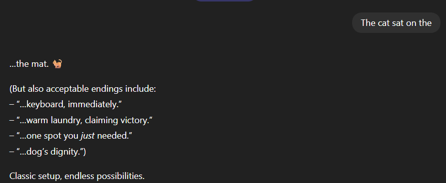
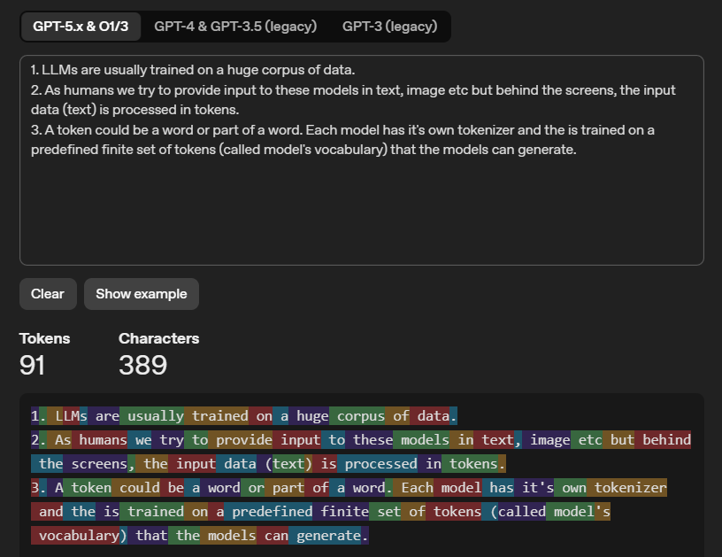

# Basics on LLMs

1. LLMs (Large Language Models), are generative AI models which generates texts, images, video, audio.
2. To put it simply I can say LLMs are nothing but next-token predictors.
3. Example:- type `The cat sat on the ` in ChatGPT and observe the response,

Why does it say the `mat`, it could have generated anything, the reason being it has trained on a huge corpus of data and predicts that `mat` might be the best suited prediction for the provided input.

## What does tokens actually mean?

1. LLMs are usually trained on a huge corpus of data.
2. As humans we try to provide input to these models in text, image etc but behind the screens, the input data (text) is processed in `tokens`.
3. A token could be a word or part of a word. Each model has it's own tokenizer and the is trained on a predefined finite set of tokens (called `model's vocabulary`) that the models can generate.
4. Below is the OpenAI's tokenizer example,

:::tip

Watch [this](https://youtu.be/NKnZYvZA7w4?si=17DlaEg-ga1Mb45K) video to know how LLMs actually generate text.

:::
