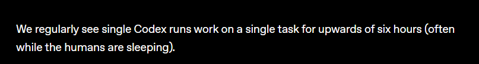

# Coding Agents

1. Earlier, when coding agents were first introduced, they were primarily working on code-completion tasks. But today, they are capable of more complex tasks and even running the background.
2. [**Here**](https://openai.com/index/harness-engineering/) is one of the recent post (as of Feb 14, 2026) by OpenAI on how they were using `Codex` to build an application without writing a single line of code.
   
3. From the above post, here are a couple of interesting points:
   1. Codex runs in the background when humans sleep, so humans can comeback, revisit and then verify what Codex has developed.
   2. The intention from OpenAI was to write a scalable, maintainable code not for humans but for subsequent `Agent` runs.
4. Coding agents has evolved a lot, once where we used `vibe-coding` to build prototypes but today one can build a very good production level application using these agents.
5. There were different modes which were released in the coding agents (ex: `Ask`, `Plan` , `Agent` in github copilot), where each one has it own use case.
6. `Agent` mode is the more powerful one where the agents run independently for several minutes and hours to achieve a specific task for the given user input.

## Some Limitations with Coding Agents

1. Anything that uses LLMs, needs right context. Without right context, the agents takes decisions on their own and complete the given task.
2. Let's say there is an engineer working in a project and using the coding agents for development. And the project has certain set of rules to be followed.
   1. Each time when a new features needs to be developed, the rules for the specific project needs to be passed in as a context all the time.
   2. The rules needs to maintained properly, and the engineer needs to provide the context each time to the agent to get better results.
3. To address these problems, [`Agents.md`](https://agents.md/) came into picture.
   1. The main concept here is to create markdown files with specific set of instructions which helps the agents to act accordingly.
   2. Similar to how `pre-commit-hooks`, `CI/CD` automation files, these agents.md files also stays in the repo, version-controlled and updated frequently.
   3. There are lot of open-source projects in GitHub where you can see `Agents.md` file in the repo.
