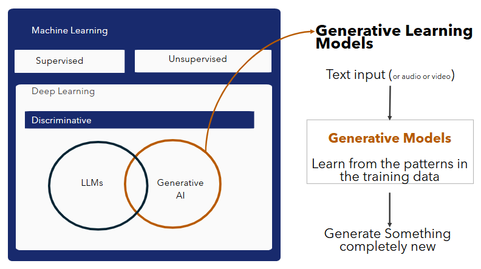

# Magic with Data is AI

- In my opinion, `a magic` one can do with `data` is Artificial Intelligence.
- The different magic goes from AI -> Machine Learning -> Deep Learning -> Generative AI.

## Machine Learning

- Predicts based on the data it is trained on.
- A couple of important terminologies which could be highlighted in machine learning is `Supervised Learning` and `Unsupervised Learning`
- Supervised Learning is where the model is trained on data that is labelled.
- Unsupervised Learning is where the model is trained on data that is unlabelled. It analyzes the data on its own to find patterns, groups or relationships without any prior knowledge.

## Generative AI

- Generative AI involves different models which is nothing but Deep Learning models that are used to `generate` new data based on the data it is trained on.

## Examples

1. Machine Learning -> Label 10 dogs and cat images and train a model and feed in an image in which the model `predicts` whether the given input is a dog or a cat.
2. Generative AI -> Train the model with 10 dog images and it will be able to `generate` a new dog image.
