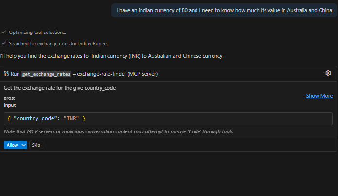
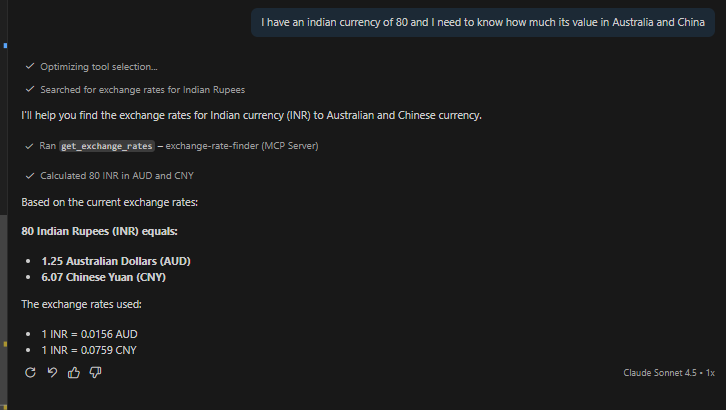
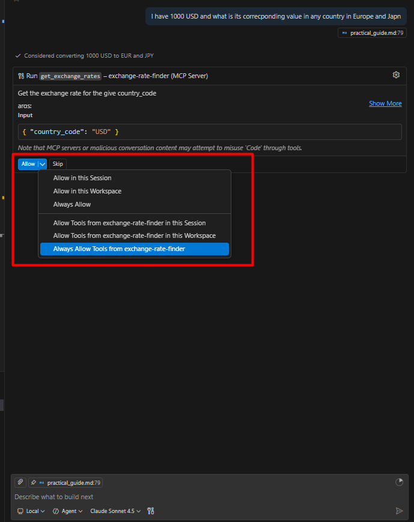

# Develop a simple MCP Server

## Exchange rate finder MCP server

- Below is a simple implementation of an MCP server using Python.
- The `MCP server` provides a simple interface for the clients to know about the currency of a country and the exchange rate of that currency with other currencies.

```python
from fastmcp import FastMCP
import requests

my_custom_app = FastMCP(name="exchange-rate-finder", port=8005)
EXCHANGE_API_BAS_URL = "https://api.exchangerate-api.com/v4/latest"


@my_custom_app.tool
def get_exchange_rates(country_code: str):
    """
    Get the exchange rate for the give country_code

    args:
    country_code:str - Country Code for which the exchange rate needs to be determined

    returns:
    dict - A dictionary containing the value for 1 currency in the given country code with other different countries.
    """
    URL = f"{EXCHANGE_API_BAS_URL}/{country_code}"
    result = requests.get(url=URL)
    if result and result.status_code == 200:
        return result.json()
    return "Error Occurred!"

if __name__ == "__main__":
    my_custom_app.run(transport="sse")
```

The name of the MCP server (named here as `exchange-rate-finder`) will be used by the clients to connect to this server and use the tools provided by this server.

### Connecting the MCP server with Github Copilot in VS Code

1. There are a couple of ways in which one can connect the MCP server with Github Copilot in VS Code
   1. Within Workspace
   2. Globally
2. To connect the MCP server within the workspace, you can create using config file or using interactive UI.
3. Create a folder named `.vscode` in the root of your workspace and create a file named `mcp.json` inside the `.vscode` folder with the following content:

```json
{
  "servers": {
    "exchange-rate-finder": {
      "url": "http://localhost:8005/sse",
      "type": "http"
    }
  },
  "inputs": []
}
```

:::tip

Detailed documentation on how to connect the MCP server with Github Copilot in VS Code can be found [**here**](https://code.visualstudio.com/docs/copilot/customization/mcp-servers).

:::

### Testing using Github Copilot



- Click `allow` to run the selected MCP server tool with the input. This is a `Human In Loop` process where the user has verify whether the correct tool is selected and the input is correct before allowing the tool to run.
- Modify the input as per your requirement and click `allow` to run the selected MCP server tool with the modified input.



- Instead of having a `Human In Loop` verification process, you can also set up the MCP server tool to run automatically.


